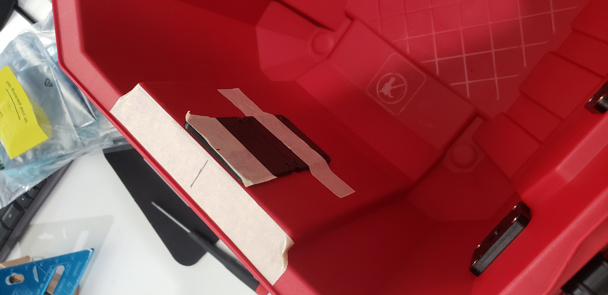

# Filament Dry Box

I wanted a proper IP65 filament dry box with some good capacity for my 3D printer. There are plenty of DIY and commercial options on the market, but I figured that I would toss my hat in the ring as well. Here it is (the hat)!

This particular design is intended to accommodate 4x 1kg rolls of filament in a 5 Gallon Husky waterproof container, but the same parts could be adapted to any container design as long as it can utilize 3/4in PVC as a spool holder axle.

## Design Highlights
* Capacity for 4x 1.75mm 1kg filament spools with independent filament feeds (enough for an MMU2 or similar multi-filament printing solution).
* A proper IP65 rated waterproof container.
* TPU gaskets on all mounting hardware to reduce air / moisture leakage into the container.
* Push to connect fittings for all filament positions. Allows a bowden tube to be connected for easy filament routing and reduced moisture ingress.
* Can be stacked with additional containers.
* Room for plenty of dessicant (loose beads or packages) below the filament spools! 

## Materials
### Parts
* [Husky 5-Gal Professional Duty Waterproof Storage Container with Hinged Lid](https://www.homedepot.com/p/Husky-5-Gal-Professional-Duty-Waterproof-Storage-Container-with-Hinged-Lid-in-Red-248918/313861296): ~$20 ea.
* [3/4in Schedule 40 PVC Pipe](https://www.homedepot.com/p/Charlotte-Pipe-3-4-in-x-10-ft-PVC-Schedule-40-Pressure-Plain-End-Pipe-PVC-04007-0600/100348472): ~$7 / 10ft. Each spool axle is only 14.5in long, so one 10ft length of pipe could be used to make up to 8 containers!
* [M6 One Touch Hose Connector](https://amzn.to/3cq630g): ~$7/10pk. Each container uses up to four of these fittings, but it depends on how many filament ports you would like to install.
* [PTFE Teflon Tubing 2mm ID x 4mm OD](https://amzn.to/3TjLa7k): ~$1.40/ft. You might want to get the 25ft option if you are planning to utilize all four filament ports with a reasonable feed distance to your printer.
* [M3x0.5mm 3.85mm Deep Threaded Heat Set Inserts](https://amzn.to/3Q1ZX3A): ~$20/100pk. Each dry box with four filament ports uses 24 of these, so this will be enough for four fully loaded dry boxes.
* [M3x16mm Stainless Steel Socket Head Screws](https://amzn.to/3CCDpnb): ~$8/100pk. Each dry box uses eight of these, so this will be enough for up to 12 dry boxes.
* [M3x12mm Stainless Steel Socket Head Screws](https://amzn.to/3Q27EqF): ~$7/100pk. A dry box with four filament ports uses 16 of these, so this will be enough for around 6 dry boxes with four filament ports each.

### Recommended Printing Materials
* Filament axle mount, filament port plates: [PETG](https://amzn.to/3wFWPno).
* Filament port gaskets: [TPU](https://amzn.to/3e6NNsW).

### Cost Estimation
If you're building just one, and want to buy enough materials for utilizing the box with all 4 filament ports and a few feet of PTFE coming off of each one, it will cost ~$81 in materials before tax, not counting the 3D printer filament.

With maximum utilization of materials (solving the bun-hotdog problem), and ignoring the cost of both print materials and PTFE tubing (the tubing is often customized per install), the materials cost per box is around $31.

## Assembly Instructions
1. Print the parts! I used 40% gyroid infill and 4x perimeter layers on the PETG parts for extra strength, and 100% infill on the TPU parts. Prints are optimized for a Prusa Mk2.5S with a 0.6mm nozzle, but they should come out fine on most printers. Make sure to position the PETG parts with heat-set-insert holes facing up. No support is needed for any of the prints if parts are properly oriented.

2. Use a soldering iron to push heat set inserts into the 4x `filament_port_inner_plate` and 2x `spool_holder_inner_plate` PETG parts. A temperature of around 650°F works well for this--it may be necessary to use some tweezers to ensure that the heat set inserts are inserted flat and level!

3. Cut a 14.5in section of PVC pipe. A hacksaw or miter saw works great for this!

4. Use a ruler to mark the center of the internal plastic protrusion above the handle. Mark the center on a corresponding `spool_holder_outer_plate`, and align it to the top edge of the box. Align a second spool holder outer plate below the top spool holder, and tape it in place. Use the lower plate's set of holes to mark drill points for the spool holders. Repeat this step on the opposite side of the box.

5. Mount the spool holder with 4x M3x16mm screws on each side. Insert the gasket between the outer spool mounting plate and the outside of the container.
6. Drill spool holder M3 mounting holes with a 1/8in drill bit.
7. Mark holes for the filament ports using a `filament_port_outer_plate`. Drill the M3 mounting holes with a 1/8in drill bit, and drill the center hole oversized with a 9/32in drill bit. Some of the features on the side of the container like the edge of the outer corner chamfer and the inset side section can be used to conveniently index and space out the filament ports.

8. Screw the 4x push to connect fittings into the 4x `filament_port_outer_plate` pieces. Make sure that the fittings are snug and flush with the end of the protrusion on the outer plate pieces, but don't tighten them down too much or they will strip the plastic!
9. Install the filament ports onto the side of the box using 4x M3x12mm screws on each port. The `filament_port_gasket` should be sandwiched between the `filament_port_outer_plate` and the outside wall of the container.

10. Cut bowden tube(s) to length and install them onto the push-to-connect fittings on the side of the container. The bowden tubes should be fixed at both ends to avoid the dry box being dragged by the print head or extruder.

